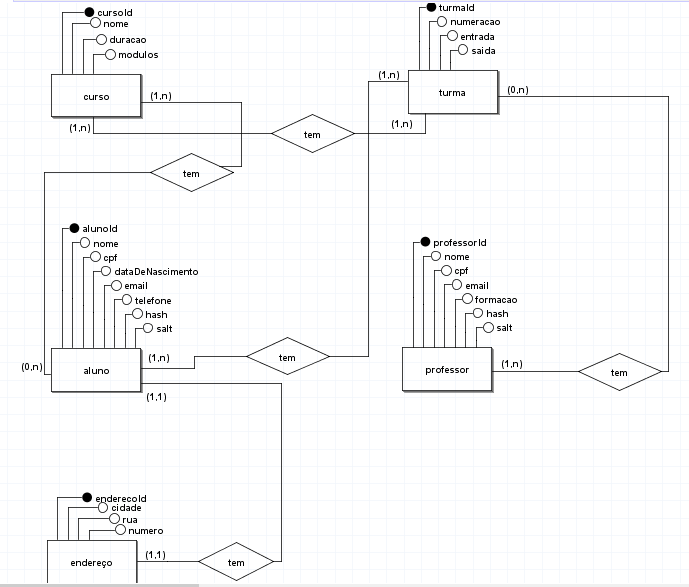

<h1 align="center"> Sistema de Acompanhamento Resilia Educação </h1>

<h5 align='center'>Projeto individual do módulo 4 (Sistema Resilia) que tem por objetivo a criação de uma modelagem de um banco de dados para armazenar dados como alunos, turmas e cursos. </h5>

<h2>Ferramentas utilizadas</h2>

<strong>- BrModelo:</strong> para funcionar é necessário ter instalado o Java e clonar esse repositório https://github.com/chcandido/brModelo

<h2>Perguntas sobre o modelo:</h2>

<h3>⇨ Existem outras entidades além dessas três?</h3>

Sim, as entidades professor e endereço foram necessárias serem criadas para fazer o banco de dados e os relacionamentos.

<h3>⇨ Quais são os principais campos e tipos?</h3>

Os principais campos são o ID das entidades, nome, cpf, forma de contato (email, telefone) e os tipos são a chave primária e a chave estrangeira.

<h3>⇨ Como essas entidades estão relacionadas?</h3>

um para muitos, um para um e 0 para muitos

Feito por Letícia Dayane

